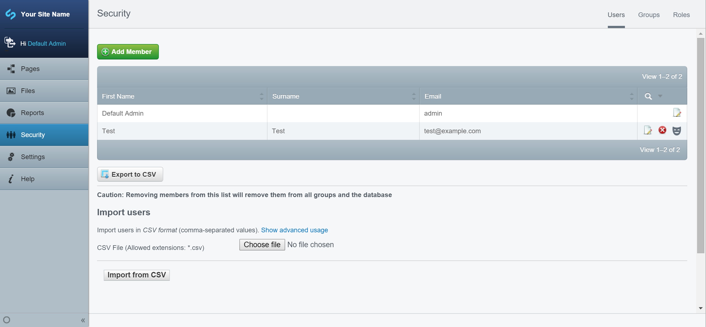

# SilverStripe Masquerade Module

## Overview

The Masquerade module allows administrators to impersonate other users without needing their password.
This is useful for debugging issues, providing remote support, and verifying bugs that users report.

When masquerading, the administrator's session remains active but requests are handled as if the
target user is logged in. Logging out while masquerading ends the impersonation and returns the
administrator to their own session.

## Requirements

- SilverStripe Framework ^6
- PHP 8.1+
- ADMIN permission

## How it works

The module adds a "Masquerade" button to the Users tab in the Security admin. Clicking the button
on a user row will start a masquerade session as that user.

### Starting a masquerade session

1. Navigate to the **Security** section in the CMS
2. On the **Users** tab, find the user you want to masquerade as
3. Click the **Masquerade** button (mask icon) in the actions column

The page will reload and you will be browsing the site as the selected user.

### Ending a masquerade session

To stop masquerading, simply log out. This will end the impersonation and return you to your own
administrator session — you will not be fully logged out.

## Permissions

Only users with the `ADMIN` permission can masquerade as other users. Administrators cannot
masquerade as themselves.
